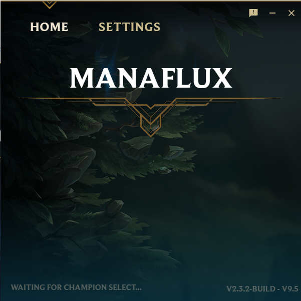

# Manaflux

An assistant that can choose your runes, summoner spells, and item sets for League of Legends.

## Key Features
- Automatic Runes, Item Sets, and Summoner Spells downloading
- Ability to change positions (roles, e.g MIDDLE, TOP) using the User Interface or the shortcuts
<kbd>Alt+Left Arrow</kbd> or <kbd>Alt+Right Arrow</kbd>
- You can hide it automatically in taskbar when you're not in champion select
- Instead of controlling your mouse to setup your runes, Manaflux injects them directly in the client, so you don't have to do anything but pick your champion.
- Optimized network requests!
- Control Manaflux from your phone ! (coming soon)

## Getting Started

#### Windows
 > Download the last .exe file in the releases tab, and execute it. That's all !
 The software will be installed on your computer then launched.

#### Mac OS X and Linux
 > You'll need to clone and build it by yourself: `npm install && electron .` Support is unofficial, but if you find an issue feel free to open a ticket.

#### Will I get banned if I use this ?
> Nope. As stated by Riot Git Gene [here](https://www.reddit.com/r/leagueoflegends/comments/97s4co/so_i_created_a_program_that_automatically_handles/e4bgdmy), Riot allows my app as long as it doesn't affect directly in-game play. (it doesn't.). If something changes, they'll contact me first to fix the problem or even shutdown the repo if it's really necessary. You won't have any problems.

## Built with
- [Electron](https://electronjs.org/)
- [NodeJS](https://nodejs.org)
- Web Technologies: HTML5, CSS3 and JavaScript for rendering
- [LeaguePlug](https://github.com/Ryzzzen/manaflux/tree/master/objects/leagueplug), Simplifies the connection to League of Legends client
- [flu.x](https://github.com/Ryzzzen/manaflux-server), Speeds up the downloads between you and the providers

## Credits
Thanks to my friends who gave me the idea of making this software, without them this would've not existed!

## Contact
You can use [Discord](https://discordapp.com/invite/4KTJax9) to contact me, if you have issues with the app or if you want to talk about enhancements!
